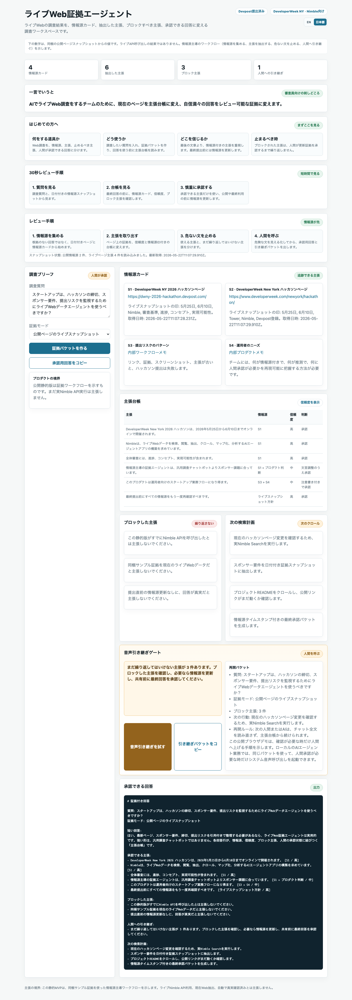

# Live Web Evidence Agent

Live Web Evidence Agent is an agentic research workflow for DeveloperWeek New York 2026.

It is built around a simple rule: AI can help search and summarize, but every useful claim must be tied to a source, a confidence level, and a human approval state.

## Public Status

- Challenge: DeveloperWeek New York 2026 Hackathon
- Sponsor fit: Nimble — Build an Agentic App That Sees the Live Web
- Official Devpost: https://dwny-2026-hackathon.devpost.com/
- Public repo: https://github.com/daideguchi/live-web-evidence-agent
- Public app: https://daideguchi.github.io/live-web-evidence-agent/
- Japanese README: [README.ja.md](README.ja.md)
- YouTube demo: https://youtu.be/td_iwN247TE
- Release assets: https://github.com/daideguchi/live-web-evidence-agent/releases/tag/v0.1-submission
- Current data mode: live public-page snapshot plus browser-side workflow
- Final submission: submitted on DeveloperWeek New York 2026 Devpost for the Nimble sponsor prize on 2026-05-27

## Judge Quick Read

One-sentence pitch:

```text
For teams using AI to research the live web, Live Web Evidence Agent turns current pages into a claim ledger so confident answers become reviewable evidence.
```

Who it helps: teams that use AI to research live web pages but still need a human-safe approval trail.

The problem: AI can sound confident even when a claim is stale, weakly sourced, or unsafe to repeat.

How it solves the problem: the app turns a research question into a review path: pull sources, extract claims, block unsafe lines, call the human, and export an approval-ready answer.

What is proven now: the public app loads a dated public-page snapshot, renders source cards and a claim ledger, blocks unsafe claims, creates a human handoff packet, and verifies screenshots, demo video, claim boundaries, and no-secrets status.

## 30-Second Review Path

1. Read the one-sentence pitch to understand the source-to-claim workflow.
2. Open the live app and build the evidence packet.
3. Check source cards, confidence labels, and blocked claims before reading the final answer.
4. Confirm the boundary: public static mode proves the workflow, not real Nimble API usage or automatic truth verification.

## Problem

People ask AI to research the live web, then get a confident answer with weak traceability.

For product teams, founders, investors, and operators, the problem is not only speed. The problem is knowing what was found, where it came from, what is still uncertain, and which claims are unsafe to repeat.

## Solution

Live Web Evidence Agent turns a research question into:

- source cards
- extracted claims
- confidence labels
- blocked claims
- voice handoff gate for human review
- follow-up search plan
- approval-ready answer

The app is designed so a live web provider such as Nimble can feed the evidence table, while the user keeps control of which claims are approved. When the agent finds a claim that should not be repeated yet, it prepares a human handoff packet and a browser-side voice prompt so the next person can review the risky part instead of rereading the whole session.

## One-Screen Review Hub

- Live app: https://daideguchi.github.io/live-web-evidence-agent/
- GitHub repo: https://github.com/daideguchi/live-web-evidence-agent
- Screenshot: `media/live-web-evidence-agent-full.png`
- Narrated demo video: `media/live-web-evidence-agent-demo-narrated.mp4`
- Public evidence snapshot: `data/evidence_snapshot.json`
- Submission package: [SUBMISSION_PACKAGE.md](SUBMISSION_PACKAGE.md)
- Final-submit checklist: [submission/final-submit-checklist.md](submission/final-submit-checklist.md)

Current verification screenshot:



## Review Path

1. Pull sources - load dated source cards from the public-page snapshot.
2. Extract claims - convert source evidence into confidence-labeled claim rows.
3. Block unsafe lines - keep risky statements out of the final answer.
4. Call the human - produce a resume packet and voice handoff preview.
5. Export answer - copy only the approval-ready answer with blocked claims still visible.

## Demo Video Asset

Current narrated review asset:

```text
media/live-web-evidence-agent-demo-narrated.mp4
```

Public release download:

```text
https://github.com/daideguchi/live-web-evidence-agent/releases/download/v0.1-submission/live-web-evidence-agent-demo-narrated.mp4
```

YouTube demo:

```text
https://youtu.be/td_iwN247TE
```

It includes:

- 1440x1080 screen recording
- English narration
- embedded English subtitle track
- generated thumbnail at `media/live-web-evidence-agent-demo-thumb.png`

## What It Does Not Claim

- It does not claim real Nimble API usage yet.
- It does not claim Nimble-powered live extraction in the public static build.
- It does not claim automatically verified truth.
- It does not replace human review.
- The voice handoff in the public app is a browser-side preview, not an external notification service.

## Run

```bash
open index.html
```

## Verify

```bash
npm run verify
```

Refresh the public source snapshot:

```bash
npm run refresh:sources
```

The snapshot is written to:

```text
data/evidence_snapshot.json
```

## Next

1. Add Nimble Search / Extract / Crawl integration when credentials are available.
2. Add backend proxy for live API calls.
3. Add source snapshots and run history.
4. Add exportable evidence packets for teams.
5. Connect the handoff packet to a local or enterprise notification channel when a human approval gate is reached.
